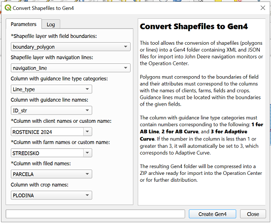

# qgis-convertshpgen4-plugin - John Deere Tools

This plugin enables the conversion of spatial data into a format compatible
with the application in new John Deere agricultural machinery monitors.

## Installation

The plugin has not been officially published in the QGIS repository yet, 
so it must be installed manually.

For new version [QGIS 3.36 'Maidenheard'](https://qgis.org/en/site/forusers/download.html), it is recommended
to uninstall and reinstall the Fiona library. On Windows open
OSGeo4w Shell with QGIS as Administrator and type:

```bash
pip uninstall fiona
pip install fiona
```

In Linux or macOS, you can install the library using the Terminal, 
as QGIS uses the standard Python installation. 

To add the plugin to QGIS 3.3 manually, you can follow these steps:

1. Download plugin repository from GitHub: https://github.com/sirpetr/convert_shapefile_gen4.git
2. Open QGIS 3.3x and go to ```Plugins``` -> ```Manage and Install Plugins``` -> ```Install from ZIP```
and browse select ZIP file and ```Install Plugin```
3. In ```Manage and Install Plugins``` -> ```Installed``` make sure if is checked John Deere Tools

A new icon for John Deere Tools will be added to the Vector menu and the QGIS main panel.


## Tool Convert Shapefiles to Gen4 and example requirements

This tool allows the conversion of shapefiles (polygons or lines) into a Gen4 folder
containing XML and JSON files for import into John Deere navigation monitors or 
the Operation Center.

To run the practical example, you need an input shapefile layer with polygons and an optional shapefile layer with lines. 
Both layers should be in the WGS 1984 coordinate system (EPSG:4326). 
The next parameters are from attribute table from layer or custom text:



- **Column with <span style="color:red">client</span> names or custom name** - required parameter.
- **Column with <span style="color:blue">farm</span> names or custom name** - required parameter.
- **Column with <span style="color:yellow">field</span> names** - required parameter from attribute 
table in polygon layer. In the column, rows have to be unique values.
- **Column with <span style="color:green">crop</span> names** - not required parameter
- **Column with line names** - not required parameter from attribute 
table in line layer. In the column, rows have to be unique values. 


The resulting Gen4 folder will be compressed into a ZIP archive ready 
for import into the Operations Center or for further distribution.


## License

This QGIS plugin is under the GNU General Public License (GPL). This open-source
license allows users to freely use, modify, and distribute the software, provided that any derivative works also 
remain under the GPL. 

## Contact 
Petr Sirucek: [petr.siruck@gmail.com]()